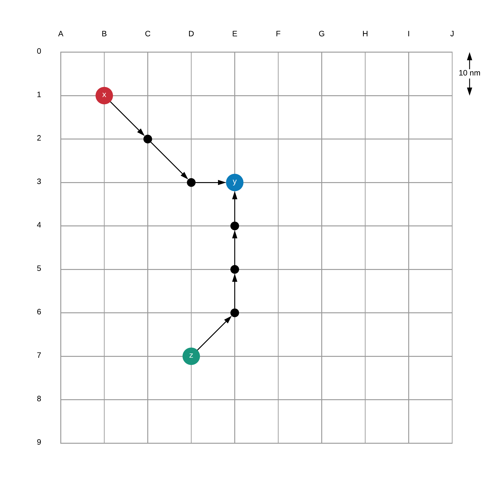
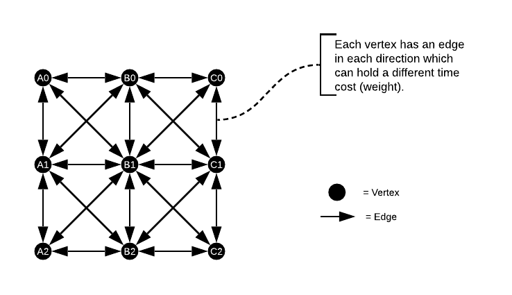
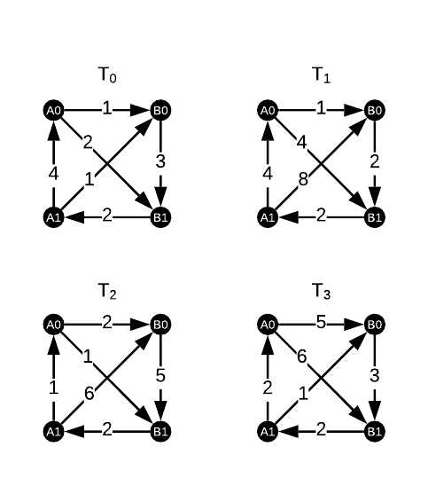

# Python Assessment Task
## Problem Definition
Problem definition
Given a set of edges on a regularly spaced grid find the path requiring the least time to be travelled for any 2 given points.

The edges information are provided as follows:
(vertex1, vertex2, timestep)=time

Vertices are in the excel format (e.g. A0, J9, AAZ121...), timesteps are from 0 to 9 in hours and time is also in hours but can be less than or more than 1 hour.
For timesteps: 0 means that the time needed between 00:00 and 01:00 (HH:MM format) is considered constant. 
If the last timestep (9) is surpassed (after 10:00) then the same value for timestep 9 must be used for all subsequent timesteps.

It's possible to specify a range in which the travelling can start (e.g. from 00:00 to 01:00).
The distance between 2 adjacent rows or 2 adjacent columns is 10 nautical miles. 

The grid is continuous both vertically and horizontally (e.g. passing the eastward boundary goes back to the first column on the same row).

Explain how the solution provided would work efficiently also for larger grids. Better if examples are provided.

### Assumptions
1. Edges are bi-directional
2. There is no waiting time at a node (wait time at node = 0)
3. _time_ is specified as a decimal e.g. 0.5 = 30 minutes
4. User input is specified as: **(start_node, end_node, start_time) e.g. A0, J5, 01:00**
5. Output will be an array of nodes in order of travel: **['A0', 'B2', 'B1']**

## Analysis
### Firstly, let's visualise the problem

**_Figure 1: Visual Representation of the Graph_**

Figure 1 shows an example of three nodes, two starting nodes (x and y), and a destination node (y).

The task is, given a starting node, say _x_, and a destination node (_y_), return the shortest route in time (not distance).

Each node is a vertex on the grid e.g. **A1**.  Each node is connected to the nodes around it, see Figure 2 for an example.

**_Figure 2: Nodes and Edges Example_**

Each edge has a time value which represents the time it will take to travel along that edge.  An edge connects two nodes (vertices) so they can be depicted like the table below.

From Node  | To Node | Weight (time in hours)
-----------|----------|-----------------------
    A0     |    B0    |    0.521  
    B0     |    A0    |    0.823  
    A0     |    B1    |    1.223  
    
#### Timesteps
So far we have been working with a static graph.  That is, a set of vertices and edges that are static.  However, the problem presented is that of a dynamic graph (a graph where the edge weights change depending on the time).

The input data specifies a timestep that is to be used as a key to determine which weight to use e.g.:

Start Node | End Node | Timestep | Weight (time)
-----------|----------|----------|-------------
    A0     |    B0    |     0    |    0.521  
    B0     |    A0    |     0    |    0.823  
    A0     |    B1    |     0    |    1.223  
    A0     |    B0    |     1    |    0.832  
    B0     |    A0    |     1    |    0.543  
    A0     |    B1    |     1    |    1.021  

The timesteps are defined as follows:-

Timestep | Actual Timeframe
---------|-----------------
   0     |  00:00 - 01:00
   1     |  01:01 - 02:00
   2     |  02:01 - 03:00
   3     |  03:01 - 04:00
   4     |  04:01 - 05:00
   5     |  05:01 - 06:00
   6     |  06:01 - 07:00
   7     |  07:01 - 08:00
   8     |  08:01 - 09:00
   9     |  09:01 - 23:59

#### Multiple Graphs
A separate graph is required to represent the different timesteps.  This will result in multiple graphs (ten in our case).

Bellow is an example with four graphs.  Notice a different weight value on some of the edges for the different timesteps. 

**_Figure 3: Multi-Graph Example_**

