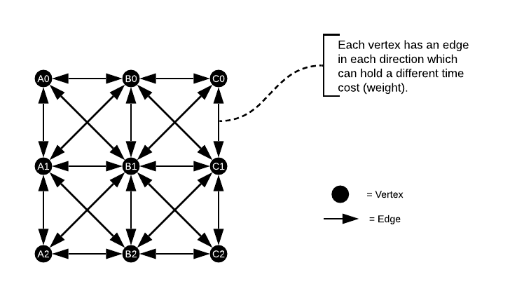
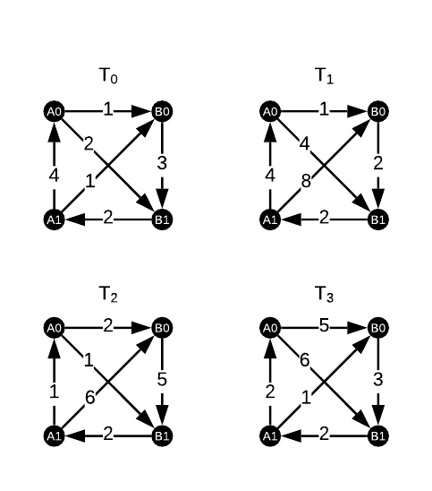
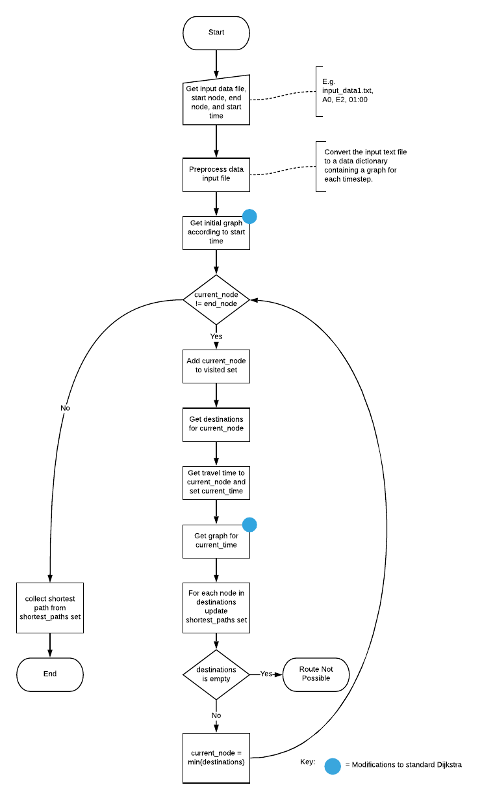

# Python Assessment Task
## Problem Definition

Given a set of edges on a regularly spaced grid find the path requiring the least time to be travelled for any 2 given points.

The edges information are provided as follows:
(vertex1, vertex2, timestep)=time

Vertices are in the excel format (e.g. A0, J9, AAZ121...), timesteps are from 0 to 9 in hours and time is also in hours but can be less than or more than 1 hour.
For timesteps: 0 means that the time needed between 00:00 and 01:00 (HH:MM format) is considered constant. 
If the last timestep (9) is surpassed (after 10:00) then the same value for timestep 9 must be used for all subsequent timesteps.

It's possible to specify a range in which the travelling can start (e.g. from 00:00 to 01:00).
The distance between 2 adjacent rows or 2 adjacent columns is 10 nautical miles. 

The grid is continuous both vertically and horizontally (e.g. passing the eastward boundary goes back to the first column on the same row).

Explain how the solution provided would work efficiently also for larger grids. Better if examples are provided.

### Assumptions
1. Edges are bi-directional
2. There is no waiting time at a node (wait time at node = 0)
3. _time_ is specified as a decimal e.g. 0.5 = 30 minutes
4. User input is specified as: **(start_node, end_node, start_time) e.g. A0, J5, 01:00**
5. Output will be an array of nodes in order of travel: **['A0', 'B2', 'B1']**
6. If there is no entry in the input data for an edge then assume that it is a cost of 1.0.

## Analysis
### Firstly, let's visualise the problem
The grid is a evenly spaced set of vertices spaced out at 10 nautical miles.  The grid wraps i.e. distance from A0 to A9 is also 10 nautical miles.

A start and end of a path is specified as a grid location e.g. start = B1, end = E3 and the path between those nodes are specified in the same way e.g. C2, D3 etc.


**_Figure 1: Visual Representation of the Graph_**

Figure 1 shows an example of three nodes, two starting nodes (x and y), and a destination node (y).

The task is, given a starting node, say _x_, and a destination node (_y_), return the shortest route in time (not distance).

Each node is a vertex on the grid e.g. **A1**.  Each node is connected to the nodes around it, see Figure 2 for an example.



**_Figure 2: Nodes and Edges Example_**

Each edge has a time value which represents the time it will take to travel along that edge.  An edge connects two nodes (vertices) so they can be depicted like the table below.

From Node  | To Node | Weight (time in hours)
-----------|---------|-----------------------
A0 |    B0   |    0.521  
B0 |    A0   |    0.823  
A0 |    B1   |    1.223  
    
#### Timesteps
So far we have been working with a static graph.  That is, a set of vertices and edges that are static.  However, the problem presented is that of a dynamic graph (a graph where the edge weights change depending on the time).

The input data specifies a timestep that is to be used as a key to determine which weight to use e.g.:

Start Node | End Node | Timestep | Weight (time)
-----------|----------|----------|-------------
A0     |    B0    |     0    |    0.521  
B0     |    A0    |     0    |    0.823  
A0     |    B1    |     0    |    1.223  
A0     |    B0    |     1    |    0.832  
B0     |    A0    |     1    |    0.543  
A0     |    B1    |     1    |    1.021  

The timesteps are defined as follows:-

Timestep | Actual Timeframe
---------|-----------------
   0     |  00:00 - 01:00
   1     |  01:01 - 02:00
   2     |  02:01 - 03:00
   3     |  03:01 - 04:00
   4     |  04:01 - 05:00
   5     |  05:01 - 06:00
   6     |  06:01 - 07:00
   7     |  07:01 - 08:00
   8     |  08:01 - 09:00
   9     |  09:01 - 23:59

#### Multiple Graphs
A separate graph is required to represent the different timesteps.  This will result in multiple graphs (ten in our case).

Bellow is an example with four graphs.  Notice a different weight value on some of the edges for the different timesteps. 



**_Figure 3: Multi-Graph Example_**

Each graph represents a timestep e.g. if the start time is 01:30 that will fall into T1 and as the traveller moves along a path, the travel time increases and when reaching a new node, depending on the time travelled, the next node may need to be referenced from a different graph.

## Design
This problem is a _shortest path problem_, or rather, a _time-dependent shortest path problem_.  To solve such a problem we can use **_Dijkstra's Shortest Path Algorithm_**.  We will modify it to cope with the time-dependent aspect to our graphs.

Figure 4 below outlines the flow that will be implemented.



## Implementation
The solution is implemented as a Python microservice that exposes a Restful API which is as follows:

#### API
POST | http://localhost:5001/route?start=A0&end=E1&start_time=02:00
-------|------------

PARAMS | Example Value |
-------|----
start | A0
end | E1
start_time | 02:00

BODY | formdata |
-------|----
file | input_data2.txt

Example Request:
```python
import requests

url = "http://localhost:5001/route?start=A0&end=E1&start_time=02:00"

payload = {}
files = [
  ('file', open('/home/andy/code/python/om_task/data/input_data2.txt','rb'))
]
headers= {}

response = requests.request("POST", url, headers=headers, data = payload, files = files)

print(response.text.encode('utf8'))

```

Example Response:
Status: 201
```json
{
  "message": "Shortest path successfully calculated.",
  "start": "A0",
  "end": "E1",
  "start_time": "Thu, 13 Aug 2020 02:00:00 GMT",
  "path": [
    "A0",
    "B9",
    "C0",
    "D1",
    "E1"
  ]
}
```

## Notes About Chosen Solution
After some initial research on shortest path algorithms comparing _Dijkstra_, _A*_, _Bellman-Ford_; the author decided
upon _Dijkstra_ for the following reasons:

1. Easier to understand (_author is inexperienced in shortest path problems_)
2. Experts seem to claim that _Dijkstra_ is better for large graphs (see [white paper](https://openproceedings.org/2008/conf/edbt/DingYQ08.pdf))
3. There are no negative edges in the input data (_Dijkstra_ only supports positive edge values)
4. _Dijkstra_ can be extended to prioritise other attributes such as direction and distance to improve the optimisation of the algorithm

Very large graphs could be a problem for any _shortest path for weighted edges_ algorithms, however, large graphs could be split into smaller graphs and separately loaded into memory as required.

As the weights are small, the current solution could be optimised to use [Dial's version](https://www.geeksforgeeks.org/dials-algorithm-optimized-dijkstra-for-small-range-weights/).

## Installation and Run Instructions
##### Clone this repo
`git clone https://github.com/abax1/om_task.git`

##### Create virtual environment
`python -m venv ./venv`

##### Activate virtual environment
`source ./venv/bin/activate`

##### Install packages
`pip install -r requirements.txt`

##### Run the microservice
`python run.py`

Now you should see a server running on localhost port 5001.  See [API](https://github.com/abax1/om_task#api) section to use endpoint.

